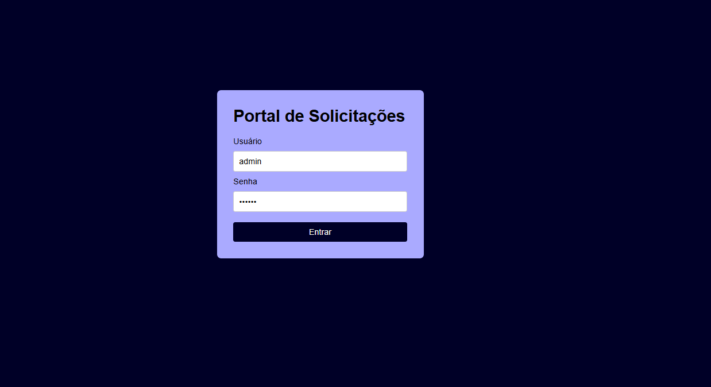
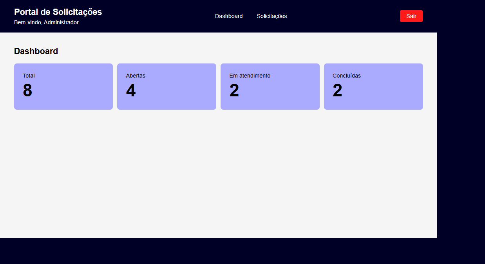
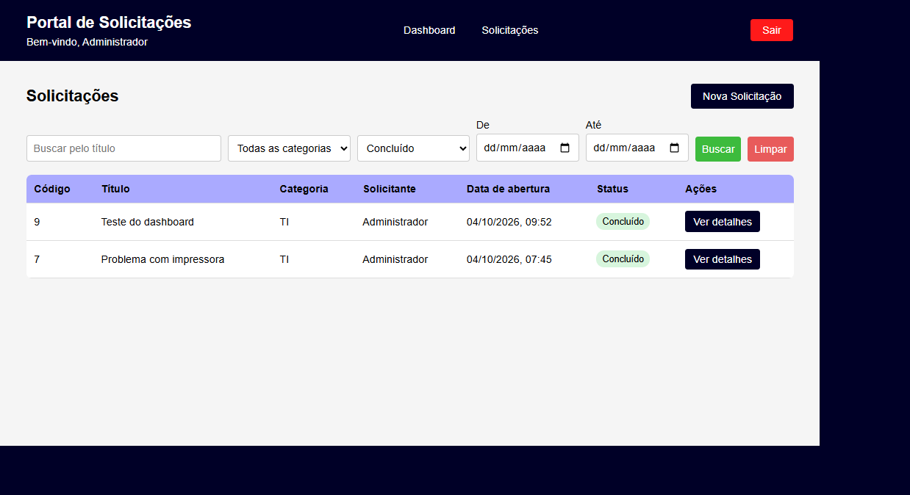
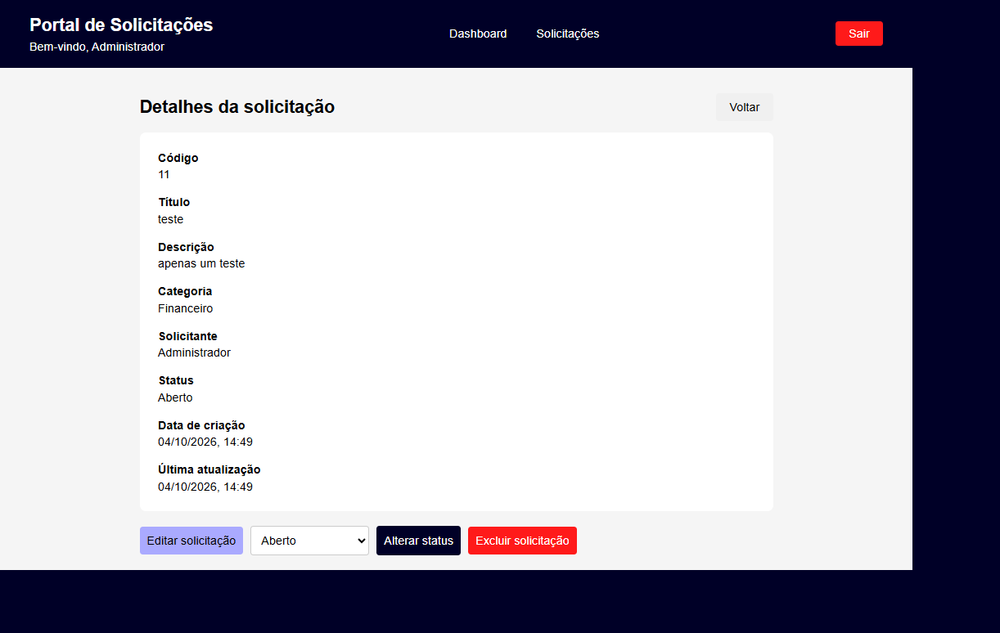
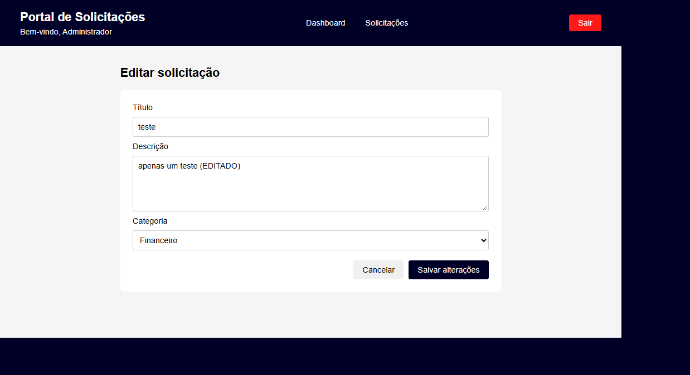

# Portal de Solicitações Internas

Projeto desenvolvido como parte de um desafio técnico para uma vaga de Desenvolvedor Full Stack Júnior.

O sistema permite que usuários autenticados registrem e acompanhem solicitações internas de diferentes setores da empresa. Também é possível consultar detalhes, editar e excluir solicitações abertas, alterar status, aplicar filtros e visualizar indicadores no dashboard.

## Funcionalidades

- Login com usuário e senha
- Autenticação utilizando JWT
- Controle de sessão e logout
- Criação de solicitações
- Listagem de solicitações
- Consulta dos detalhes de uma solicitação
- Edição de solicitações abertas
- Exclusão de solicitações abertas
- Alteração de status
- Filtros por título, categoria, status e período
- Dashboard com indicadores de solicitações totais, abertas, em atendimento e concluídas
- Layout responsivo para diferentes tamanhos de tela

## Tecnologias utilizadas

### Frontend

- JavaScript
- React
- Vite
- React Router DOM
- Axios
- CSS

### Backend

- Node.js
- Express
- JSON Web Token (JWT)
- bcryptjs
- CORS
- dotenv

### Banco de dados

- SQLite

## Estrutura do projeto

```text
portal-solicitacoes/
├── backend/
│   └── src/
│       ├── banco/
│       ├── controladores/
│       ├── middlewares/
│       ├── rotas/
│       └── servidor.js
│
├── database/
│   └── estrutura.sql
│
├── docs/
│   ├── evidencias/
│   ├── dicionario-de-dados.md
│   ├── dicionario-de-dados.pdf
│   ├── memorial-tecnico.md
│   └── memorial-tecnico.pdf
│
├── frontend/
│   └── src/
│       ├── componentes/
│       ├── paginas/
│       ├── servicos/
│       ├── App.jsx
│       └── main.jsx
│
└── README.md
```

## Pré-requisitos

Para executar o projeto é necessário ter instalado:

- Node.js 20.19+ ou 22.12+
- npm
- Git

A linguagem utilizada no frontend e no backend é JavaScript.

O banco de dados utilizado é o SQLite. Não é necessário instalar um servidor de banco de dados separado, pois o arquivo do banco é criado automaticamente pela aplicação.

As dependências do frontend e do backend estão declaradas nos respectivos arquivos `package.json` e são instaladas com `npm install`.

## Instalação

### 1. Clonar o repositório

```bash
git clone https://github.com/luizmouradc/portal-solicitacoes.git
cd portal-solicitacoes
```

### 2. Instalar o backend

```bash
cd backend
npm install
```

### 3. Instalar o frontend

Em outro terminal, a partir da raiz do projeto:

```bash
cd frontend
npm install
```

## Configuração

### Backend

Na pasta `backend`, crie um arquivo `.env` com base no arquivo `.env.example`:

```text
CHAVE_JWT=chave_portal_solicitacoes
PORT=3000
```

A variável `CHAVE_JWT` é utilizada para assinar e validar os tokens de autenticação.

A variável `PORT` é opcional. Caso não seja informada, o backend utiliza a porta `3000`.

### Frontend

O frontend utiliza por padrão a API em:

```text
http://localhost:3000/api
```

Caso seja necessário utilizar outro endereço, crie um arquivo `.env` dentro da pasta `frontend` com base no `.env.example`:

```text
VITE_API_URL=http://localhost:3000/api
```

## Banco de dados e usuário inicial

O arquivo `database/estrutura.sql` contém os comandos de criação das tabelas.

O banco SQLite é criado automaticamente em `database/portal.db` quando a aplicação é executada. Esse arquivo não precisa ser enviado ao repositório, pois cada ambiente pode gerar sua própria base local.

Para criar o usuário de demonstração, execute dentro da pasta `backend`:

```bash
npm run criar-usuario
```

Esse comando também cria a estrutura do banco caso ela ainda não exista.

## Execução

### Backend

Dentro da pasta `backend`:

```bash
npm run dev
```

O backend ficará disponível, por padrão, em:

```text
http://localhost:3000
```

A API utiliza o endereço:

```text
http://localhost:3000/api
```

Também é possível iniciar sem o Nodemon utilizando:

```bash
npm start
```

### Frontend

Dentro da pasta `frontend`:

```bash
npm run dev
```

O frontend ficará disponível normalmente em:

```text
http://localhost:5173
```

## Acesso

Credenciais de demonstração:

```text
Usuário: admin
Senha: 123456
```

Caso o usuário ainda não exista, execute `npm run criar-usuario` dentro da pasta `backend`.

## Regras principais

### Status das solicitações

- Aberto
- Em Atendimento
- Concluído

Novas solicitações são criadas automaticamente com o status `Aberto`.

Somente solicitações com status `Aberto` podem ser editadas ou excluídas.

### Categorias disponíveis

- TI
- RH
- Compras
- Financeiro
- Infraestrutura

## Documentação

A documentação complementar está disponível na pasta `docs`:

- [Memorial Técnico de Desenvolvimento](docs/memorial-tecnico.pdf)
- [Memorial Técnico em Markdown](docs/memorial-tecnico.md)
- [Dicionário de Dados](docs/dicionario-de-dados.pdf)
- [Dicionário de Dados em Markdown](docs/dicionario-de-dados.md)
- [Script de criação do banco de dados](database/estrutura.sql)

## Evidências da aplicação

### Login



### Dashboard



### Listagem de solicitações



### Nova solicitação


### Detalhes da solicitação



### Edição da solicitação



## Autor

Luiz Inácio Moura da Costa
